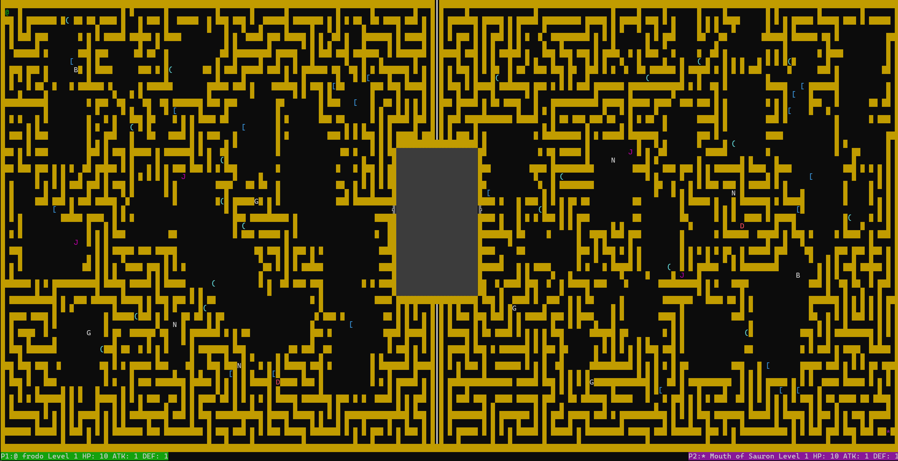
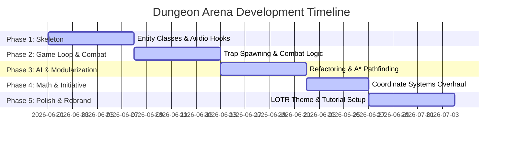

# Dungeon Arena: Frodo's Adventure

```text
                    ___              _
                   / __\ __ ___   __| | ___  ___
                   / _\| '__/ _ \ / _` |/ _ \/ __|
                   / /  | | | (_) | (_| | (_) \__ \
                   \/   |_|  \___/ \__,_|\___/|___/

                _       _                 _
               /_\   __| |_   _____ _ __ | |_ _   _ _ __ ___
               //_\\ / _` \ \ / / _ \ '_ \| __| | | | '__/ _ \
               /  _  \ (_| |\ V /  __/ | | | |_| |_| | | |  __/
               \_/ \_/\__,_| \_/ \___|_| |_|\__|\__,_|_|  \___|
```

Dungeon Arena is a procedural, terminal-based roguelike game inspired by *The Lord of the Rings*. You play as Frodo Baggins (`@`), traversing a dangerous procedurally generated labyrinth. On the opposing side, your autonomous rival, the Mouth of Sauron (`*`), hunts for upgrades and monsters to grow stronger. Your ultimate objective is to breach the central arena, gain powerful relics, and defeat the Mouth of Sauron in a final combat showdown.



## Core Features

- **Procedural Maze Generation:** Leverages a Depth-First Search (DFS) algorithm combined with randomized room carving to generate a unique labyrinth on every run, adapted to your terminal dimensions.
- **Autonomous AI Rival:** The Mouth of Sauron (`*`) operates in the background, hunting for weapons, shields, and weak mobs on its side of the dungeon, eventually marching to the central arena to challenge you.
- **Dynamic Combat System:** Initiated whenever a character steps onto a tile occupied by another entity. Turn initiative is based on who makes the movement (first strike). Damage is mathematically computed from attack (`ATK`) and defense (`DEF`) stats.
- **Traps & Upgrades:** Collect legendary items like the sword Andúril (`(`) to boost attack or Mithril Armor (`[`) to boost defense. Beware of hidden traps (`^`) that deal damage and sap stats!
- **Interactive Tutorial:** Includes an introductory sequence with lore and interactive screens explaining the controls and mechanics.
- **Dynamic Status Bar:** Renders real-time announcements of recent game events (such as combat, item pickups, or trap triggers) below the map.
- **Lord of the Rings Audio:** Uses Pygame mixer to play a dynamic soundtrack that seamlessly changes from ambient themes to tense battle music when entering the arena.

---

## Setup & Execution

### Prerequisites

- **Python:** Version 3.8 or higher.
- **Terminal:** Supports standard ANSI escape codes for coloring and styling.

### 1. Installation

Clone the repository and install the required dependencies:

```bash
pip install readchar pygame colorist
```

### 2. Launching the Game

Simply run the main dungeon script from the workspace directory:

```bash
python dungeon.py
```

---

## Gameplay & Controls

| Input | Action |
|:---:|---|
| **W** | Move Up |
| **A** | Move Left |
| **S** | Move Down |
| **D** | Move Right |
| **Q** | Quit Game |

### Entities Reference

- `@` **Frodo Baggins:** The player character.
- `*` **Mouth of Sauron:** The AI opponent/companion.
- `(` **Weapon (Andúril):** Increases ATK.
- `[` **Armor (Mithril):** Increases DEF.
- `^` **Trap:** Red-colored invisible hazards. Reduces HP, ATK, or DEF.
- `░` **Arena Floor:** Central staging area where the final showdown occurs.
- `╣` / `╠` **Arena Doors:** Player-specific blue doors that seal behind you once entered.
- **Monsters (`D`, `G`, `J`, `N`, `B`, `R`, `F`):** Mobs with varying stats and sense ranges that hunt characters down when they come too close.

→ [Jump to the Development Protocol](#project-development-protocol)

---

# Project Development Protocol

**Author:** Thomas Haiden | **Date:** 12.07.2026

This protocol documents the step-by-step engineering process of **Dungeon Arena**, transitioning from early procedural code skeletons into a modularized, fully featured terminal game with pathfinding AI, real-time events, and dynamic media.

## Project Overview and Objectives

The primary goal of this project was to implement a highly interactive terminal-based game that demonstrates fundamental computer science concepts:
1. **Procedural Level Design:** Using Depth-First Search (DFS) algorithm with backtracking to ensure a solvable, fully connected maze.
2. **Pathfinding & AI Design:** Implementing the **A* Search Algorithm** with Manhattan distance heuristics to handle real-time tracking for mobs and an autonomous opponent.
3. **Software Architecture:** Refactoring procedural spaghetti code into a clean Model-View-Controller (MVC) style modular structure.
4. **State Control:** Managing asynchronous input collection and synchronized turn rendering without visual screen flickering.

---

## Development Milestones (Commit Log Analysis)

The project progressed through five distinct phases of development:



### Phase 1: Level Spawning and Basic Entities
* **Initial Item & Equipment Logic:** Added base generation functions for items, armor, and weapons. Set up entity properties in [classes.py](file:///C:/Users/thoma/Desktop/GIT/Haiden/classes.py) (Commit `c2e3366`, `c1ba976`).
* **Audio Integration:** Developed a song system to manage ambient sounds during exploration (Commit `37749d8`).
* **Structural Boundaries:** Introduced room coordinates, dividing walls, and basic doors to divide the maze into separate zones (Commit `0e2e103`).
* **Cleanup:** Removed unused classes and unified monster generation constraints (Commit `f03c52d`).

### Phase 2: Game Loop, Traps, and Early Combat
* **Trap Physics:** Introduced the `Trap` class, spawned random trap coordinates, and checked for collision events in the loop (Commit `4440d29`).
* **Encounter Mechanics:** Integrated the `entcounter` logic to deduct player HP during combat and handle level-up events (Commit `8b7e3c5`).
* **Mob Behavior:** Refined fighting states and implemented a random movement step for inactive mobs, inspired by *Undertale* (Commit `3842720`).
* **Sound Overhauls:** Resolved audio loop issues so background music plays continuously (Commit `f45790b`).

### Phase 3: Code Modularization & A* Pathfinding
* **Architectural Refactoring:** Separated rendering and logic from `dungeon.py`, moving them to [display.py](file:///C:/Users/thoma/Desktop/GIT/Haiden/display.py) and [logic.py](file:///C:/Users/thoma/Desktop/GIT/Haiden/logic.py) (Commit `f8fc506`).
* **AI Framework:** Introduced the basis of the opponent AI player and implemented a status bar at the bottom to report updates (Commit `f61a51c`).
* **A* Search Algorithm:** Implemented the basic `astar()` search functions to compute shortest paths between coordinates (Commit `d02d7a6`, `b12e1ae`).

### Phase 4: Coordinate Conversions & Combat Initiative
* **Coordinate Space Standardization:** Refactored all coordinates from Cartesian `(x, y)` to Matrix `(row, col)` representations across all modules (Commit `6c686c7`).
* **Initiative Calculations:** Rewrote the combat logic to detect who initiated the movement (player vs. monster), giving the moving entity first-strike privilege.
* **Synchronization:** Resolved branch pull conflicts and integrated all changes into the master branch (Commit `6c686c7`, `ea00df6`).

### Phase 5: Rebranding, Multi-Phase AI, and Final Polish
* **Dynamic Audio Overhaul:** Expanded the sound directory with three distinct tracks from *The Lord of the Rings*. Hooked them to dynamically transition from exploration to battle music when entering the arena (Commit `653f18c`).
* **Interactive Tutorial:** Rebranded the game's setting to LOTR (Frodo vs. Mouth of Sauron) and wrote a multi-chapter, interactive CLI tutorial (Commit `4d7d9f5`).
* **Multi-Phase AI Decision Tree:** Upgraded the AI opponent in [player2.py](file:///C:/Users/thoma/Desktop/GIT/Haiden/player2.py) to use a 3-phase behavioral algorithm (Commit `ab51789`).
* **Performance Refinements:** Optimized the A* search algorithm heap space and adjusted recursion limits to prevent stack overflows on large terminal screens (Commit `ab51789`).

---

## Technical Implementation Details

### 1. Procedural Generation (`DFS`)
The dungeon generator uses Depth-First Search with backtracking to carve paths. Starting at a cell, it randomly selects an unvisited neighbor two units away, breaks the wall between them, and recurses. This ensures a fully traversable maze. Rooms are carved by carving out $N \times M$ spaces randomly.

### 2. A* Search Algorithm
The pathfinding engine uses the $f(n) = g(n) + h(n)$ cost function:
- $g(n)$: Actual movement cost from the start node to node $n$.
- $h(n)$: Heuristic estimate (Manhattan distance) from node $n$ to the target.
This algorithm is utilized by:
- **Active Mobs:** To track and chase characters once they enter the mob's sense range.
- **Rival AI (P2):** To execute its multi-phase goals.

### 3. Rival AI Decision Loop
```text
[Check for Items] ------(Exists)------> Move to nearest Item
       |
    (None)
       |
[Check for Mobs]  ------(Exists)------> Move to weakest Mob
       |
    (None)
       |
[Engage Player]  ---------------------> Move directly to Player (A*)
```

---

## Challenges and Lessons Learned

- **Coordinate Confusion:** Mixing up mathematical coordinate conventions `(x, y)` and array indexing `(row, col)` led to out-of-bounds crashes. Standardizing on `(row, col)` in Phase 4 solved this.
- **Recursion Limits:** Generating maps on large displays caused DFS to exceed Python's recursion limit. Increasing the system recursion ceiling to 2000 resolved the crashes.
- **Screen Flickering:** Repeatedly clearing the console using `cls` or `clear` caused severe flickering. Replacing this with the ANSI home cursor sequence `\033[H` in the render loop stabilized the display.
- **A* Memory Leaks:** Initially, large maps caused A* to evaluate too many open nodes, degrading CPU performance. Optimizing the node inspection loops and bounding search zones maintained high frame rates.

---

## Success of the Implementation

The final product delivers a fully completed, stable console roguelike. The separation of concerns between modules allows for easy scalability (e.g. adding new entity classes or tweaking generation variables). The inclusion of Lord of the Rings aesthetics, dynamic sound effects, and a highly responsive autonomous AI rival results in an engaging, challenging terminal game.
